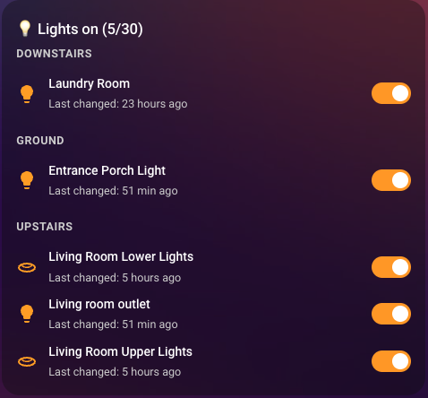
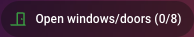
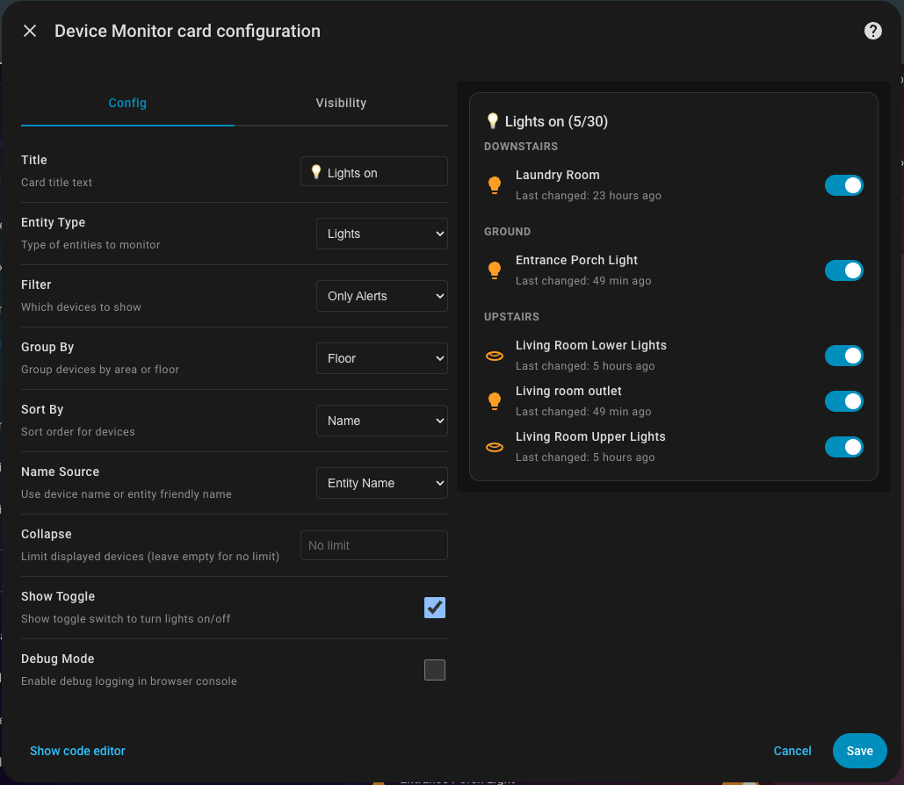

# Device Monitor Card & Badge

A versatile Home Assistant Lovelace card and badge that monitors multiple types of devices: batteries, contact sensors (doors/windows), and lights. Features smart device name resolution, grouping by area/floor, and customizable sorting.

**Includes:**
- **Device Monitor Card**: Full card with device list, details, and grouping options
- **Device Monitor Badge**: Compact horizontal badge showing [Icon] TITLE (5/30)





## Features

### Card Features
- **Multiple Entity Types**: Monitor batteries, contact sensors, or lights in a single card
- **Smart Device Naming**: Choose between device names or entity friendly names
- **Automatic Discovery**: Automatically finds entities based on device class and domain
- **Smart Grouping**: Group devices by area or floor for better organization
- **Flexible Sorting**: Sort by state (battery level/status), name, or last changed time
- **Interactive Controls**: Toggle lights on/off directly from the card (optional)
- **Custom Icons**: Respects user-configured entity icons
- **Smart Filtering**: For batteries, excludes duplicate sensors when binary_sensor.*_battery_low exists
- **Color-Coded Icons**: Dynamic icons and colors based on entity state
- **Clickable Devices**: Click any device to open its device page in Home Assistant
- **Responsive Design**: Mobile-friendly layout that matches Home Assistant's style
- **Last Changed Info**: Shows when each entity state was last updated
- **Empty State**: Displays a friendly message when all devices are in good state

### Badge Features
- **Native HA Badge**: Uses Home Assistant's `<ha-badge>` component for perfect theming
- **Auto-Theming**: Automatically adapts to HA theme changes (fonts, colors, spacing)
- **Horizontal Format**: Displays as [Icon] Text (5/30) - icon on left, count on right
- **Compact Display**: Perfect for the badge area at top of views or anywhere on dashboard
- **Same Entity Types**: Supports batteries, contact sensors, and lights
- **Color-Coded Icons**: Green (OK), Red (battery alerts), Yellow (open doors/lights on), Gray (lights off)
- **Visual Editor**: Easy configuration through Home Assistant UI
- **One Installation**: Badge and card both included in a single package

## Supported Entity Types

### Battery
- Monitors battery levels with configurable threshold
- Shows devices with low battery (or all devices)
- Color-coded icons: red (< 10%), orange (< 20%), blue (OK)
- Supports both numeric sensors and binary_sensor.*_battery_low

### Contact Sensors
- Monitors doors, windows, garage doors, and openings
- Shows which devices are currently open
- Different icons for doors, windows, and garage doors
- Detects entities with device_class: door, window, garage_door, opening

### Lights
- Monitors light states
- Shows which lights are currently on
- Optional toggle switch to turn lights on/off directly from the card
- Works with all entities in the light.* domain

## Installation

### HACS (Recommended)

1. Open HACS in your Home Assistant instance
2. Click on "Frontend"
3. Click the "+" button
4. Search for "Device Monitor Card"
5. Click "Install"
6. Clear your browser cache and hard refresh (Ctrl+F5 or Cmd+Shift+R)

### Manual Installation

1. Download `device-monitor-card.js` from the `dist/` directory in this repository
2. Copy it to your `config/www/` directory in Home Assistant
3. Add the following to your Lovelace resources:

   **Via UI:**
   - Go to Settings → Dashboards → Resources
   - Click "Add Resource"
   - URL: `/local/device-monitor-card.js`
   - Resource type: `JavaScript Module`

   **Via YAML:**
   ```yaml
   resources:
     - url: /local/device-monitor-card.js
       type: module
   ```

4. Clear your browser cache and hard refresh (Ctrl+F5 or Cmd+Shift+R)

   **Note:** A Home Assistant restart is typically not required for adding frontend resources. If the card still doesn't appear after clearing cache, try closing all browser tabs and reopening Home Assistant.

## Configuration

### Visual Editor

The card includes a visual configuration editor in Home Assistant:

1. Add a new card to your dashboard
2. Search for "Device Monitor Card" or "Battery Device Card"
3. Configure using the form fields:
   - **Entity Type**: Choose battery, contact sensors, or lights
   - **Filter**: Show only alerts or all devices
   - **Battery Threshold**: (Battery only) Low battery percentage
   - **Group By**: Organize devices by area or floor
   - **Sort By**: Order devices by state, name, or last changed
   - **Collapse**: Limit displayed devices with expand button

### Basic Configuration Examples

#### Monitor Low Batteries
```yaml
type: custom:device-monitor-card
entity_type: battery
filter: alert
battery_threshold: 20
```

#### Monitor Open Doors & Windows
```yaml
type: custom:device-monitor-card
entity_type: contact
filter: alert
title: Open Doors & Windows
```

#### Monitor Lights Left On
```yaml
type: custom:device-monitor-card
entity_type: light
filter: alert
title: Lights On
```

#### Lights with Toggle Switch
```yaml
type: custom:device-monitor-card
entity_type: light
filter: alert
show_toggle: true
title: Lights On
```

### Advanced Configuration Examples

#### Batteries Grouped by Area
```yaml
type: custom:device-monitor-card
entity_type: battery
filter: all
title: All Batteries
group_by: area
sort_by: state
```

#### Open Doors by Floor
```yaml
type: custom:device-monitor-card
entity_type: contact
filter: alert
title: Open Doors by Floor
group_by: floor
```

#### All Lights Sorted by Name
```yaml
type: custom:device-monitor-card
entity_type: light
filter: all
title: All Lights
sort_by: name
collapse: 10
```

### Configuration Options

| Option | Type | Default | Description |
|--------|------|---------|-------------|
| `entity_type` | string | `'battery'` | Type of entities to monitor: `'battery'`, `'contact'`, or `'light'` |
| `filter` | string | `'alert'` | Which devices to show: `'alert'` (problematic only) or `'all'` (all devices) |
| `battery_threshold` | number | `20` | (Battery only) Battery percentage threshold for low battery alerts |
| `title` | string | Auto | Card title (auto-generates based on entity_type if not specified) |
| `group_by` | string | `null` | Group devices: `null`, `'area'`, or `'floor'` |
| `sort_by` | string | `'state'` | Sort order: `'state'`, `'name'`, or `'last_changed'` |
| `name_source` | string | `'device'` | Display name: `'device'` (device name) or `'entity'` (entity friendly name) |
| `show_toggle` | boolean | `false` | (Light only) Show toggle switch to turn lights on/off |
| `collapse` | number | `undefined` | If set, collapse to show only this many devices with expand button |
| `debug` | boolean | `false` | Enable debug logging in browser console |

### Default Titles

If no title is specified, the card auto-generates based on entity type:
- Battery: "Low Battery"
- Contact: "Open Doors & Windows"
- Light: "Lights On"

## How It Works

### Entity Discovery

The card discovers entities based on the configured `entity_type`:

**Battery:**
- Entities with `device_class: battery`
- Entities with "battery" in the entity ID (sensor.* or binary_sensor.* only)
- Binary sensors with `*_battery_low` in the name
- Excludes non-level entities: `_state`, `_charging`, `_charger`, `_power`, `_health`

**Contact:**
- Binary sensors with device_class: `door`, `window`, `garage_door`, or `opening`

**Light:**
- All entities in the `light.*` domain

### Grouping

When `group_by` is set to `'area'` or `'floor'`:
1. Devices are organized into sections by their assigned area/floor
2. Each section gets a header with the area/floor name
3. Devices without an area/floor are grouped under "No Area" or "No Floor"
4. Sections are sorted alphabetically

### Sorting

The `sort_by` option controls device ordering:

- **state** (default):
  - Batteries: Sorted by battery level (lowest first)
  - Contact/Light: Sorted by name
- **name**: Alphabetical by device name
- **last_changed**: Most recently changed first

### Device Resolution

For each entity, the card:
1. Gets the device_id from the entity registry
2. Looks up the device in the device registry
3. Resolves the device name (prefers `name_by_user` over `name`)
4. Gets the area_id from the device (for grouping)
5. Gets the area/floor information from registries

## Device Monitor Badge

The Device Monitor Badge provides a compact horizontal badge to display device alert counts. It uses Home Assistant's native `<ha-badge>` component, ensuring perfect integration with your theme.

The badge displays horizontally with:
- Color-coded icon on the left
- Alert count text on the right: "Low Battery (3/15)"
- Automatic font and spacing from your HA theme
- Format: [🔋] "TITLE (alert_count/total_devices)"

### Badge Configuration

The badge supports a simpler configuration than the full card:

```yaml
type: custom:device-monitor-badge
entity_type: battery
title: Low Battery
battery_threshold: 20
```

### Tap Actions

The badge supports configurable tap actions. When a tap action is configured, the badge becomes clickable (cursor changes to pointer).

#### Available Actions

**None (default)**
```yaml
tap_action:
  action: none
```

**Navigate** - Navigate to a different view or page
```yaml
tap_action:
  action: navigate
  navigation_path: /lovelace/0
```

**URL** - Open a URL (internal or external)
```yaml
tap_action:
  action: url
  url_path: https://example.com
```

**Call Service** - Call a Home Assistant service
```yaml
tap_action:
  action: call-service
  service: light.turn_on
  service_data: {}  # Optional service data
```

**Toggle** - Toggle an entity on/off
```yaml
tap_action:
  action: toggle
  entity_id: light.living_room
```

**More Info** - Show the more-info dialog for an entity
```yaml
tap_action:
  action: more-info
  entity_id: sensor.battery_level
```

#### Tap Action Examples

**Navigate to a dashboard view:**
```yaml
type: custom:device-monitor-badge
entity_type: battery
title: Low Battery
tap_action:
  action: navigate
  navigation_path: /lovelace/batteries
```

**Open device monitor card:**
```yaml
type: custom:device-monitor-badge
entity_type: contact
title: Open Doors
tap_action:
  action: navigate
  navigation_path: /lovelace/security
```

**Toggle a light:**
```yaml
type: custom:device-monitor-badge
entity_type: light
title: Lights On
tap_action:
  action: toggle
  entity_id: light.all_lights
```

**Show more info for an entity:**
```yaml
type: custom:device-monitor-badge
entity_type: battery
title: Low Battery
tap_action:
  action: more-info
  entity_id: sensor.house_battery
```

### Badge Configuration Options

| Option | Type | Default | Description |
|--------|------|---------|-------------|
| `entity_type` | string | `'battery'` | Type of entities to monitor: `'battery'`, `'contact'`, or `'light'` |
| `title` | string | Auto | Badge title (auto-generates based on entity_type if not specified) |
| `battery_threshold` | number | `20` | (Battery only) Battery percentage threshold for low battery alerts |
| `tap_action` | object | `{ action: 'none' }` | Action to perform when badge is tapped (see Tap Actions below) |
| `debug` | boolean | `false` | Enable debug logging in browser console |

### Quick Start: Add Badges to Top of View

To add badges to the **badges section at the very top** of your view (above all cards):

1. **Edit your dashboard** in YAML mode
2. **Add to the `badges:` array** under your view:

```yaml
views:
  - title: Home
    badges:
      # Battery monitoring badge
      - type: custom:device-monitor-badge
        entity_type: battery
        title: Low Battery
        battery_threshold: 25

      # Door/window monitoring badge
      - type: custom:device-monitor-badge
        entity_type: contact
        title: Open Doors

      # Lights monitoring badge
      - type: custom:device-monitor-badge
        entity_type: light
        title: Lights On

    cards:
      # Your regular cards here
```

**Result:** Badges appear horizontally at the top:
- [🔋] Low Battery (3/15) | [🚪] Open Doors (0/8) | [💡] Lights On (2/12)

### Badge Display Format

Each badge shows:
- **Icon**: Color-coded (green=OK, red=battery alerts, yellow=doors/lights)
- **Title and Count**: "Title (alerts/total)"
  - Battery: Shows devices below threshold / total battery devices
  - Contact: Shows open doors/windows / total contact sensors
  - Lights: Shows lights on / total lights

### Adding the Badge

**Method 1: YAML (Recommended for Badges Section)**

Add to the `badges:` section at the top of your view:

```yaml
views:
  - title: Home
    badges:
      - type: custom:device-monitor-badge
        entity_type: battery
        title: Low Battery
        battery_threshold: 20
        tap_action:
          action: navigate
          navigation_path: /lovelace/batteries
      - type: custom:device-monitor-badge
        entity_type: contact
        title: Open Doors
        tap_action:
          action: navigate
          navigation_path: /lovelace/security
      - type: custom:device-monitor-badge
        entity_type: light
        title: Lights On
        tap_action:
          action: toggle
          entity_id: light.all_lights
```

This will display the badges **horizontally at the very top** of your view, above all cards. Each badge is clickable and will perform the configured tap action.

**Method 2: Visual Editor (For Cards Section)**

1. Click "Add Card" in your dashboard
2. Search for "Device Monitor Badge"
3. Configure using the visual editor
4. Badge can be placed anywhere in the cards grid

**Note:** To get badges in the badges section at the top, use YAML Method 1. The "Add Badge" picker may not show custom badges, so YAML configuration is the most reliable method.

### Badge Visual Editor

The badge includes a visual configuration editor:
- **Title**: Badge title text
- **Entity Type**: Choose battery, contact sensors, or lights
- **Battery Threshold**: (Battery only) Low battery percentage
- **Tap Action**: Configure what happens when the badge is tapped
  - **Action Type**: None, Navigate, URL, Call Service, Toggle, or More Info
  - **Action-specific fields**: Additional fields appear based on selected action type

### Badge Colors

The badge icon color changes based on alert state:
- **Battery**: Green (all OK) or Red (alerts present)
- **Contact**: Green (all closed) or Yellow (doors/windows open)
- **Light**: Gray (all off) or Yellow (lights on)

## Display Behavior

### Filter Modes

**`filter: 'alert'`** (default)
- Battery: Shows only devices below threshold
- Contact: Shows only open doors/windows
- Light: Shows only lights that are on

**`filter: 'all'`**
- Shows all discovered devices
- Alert devices shown first
- Divider separates alert and normal devices (unless grouped)

### Empty States

When no alert devices are found with `filter: 'alert'`:
- Battery: "All batteries are OK!"
- Contact: "All doors and windows are closed!"
- Light: "All lights are off!"

## Examples

### Dashboard with Multiple Cards

```yaml
views:
  - title: Home
    cards:
      # Low batteries
      - type: custom:device-monitor-card
        entity_type: battery
        filter: alert
        battery_threshold: 25

      # Open doors and windows by floor
      - type: custom:device-monitor-card
        entity_type: contact
        filter: alert
        group_by: floor
        title: Security Status

      # Lights left on
      - type: custom:device-monitor-card
        entity_type: light
        filter: alert
        title: Active Lights
```

### All Batteries with Organization

```yaml
type: custom:device-monitor-card
entity_type: battery
filter: all
title: Battery Inventory
group_by: area
sort_by: state
collapse: 15
```

### Quick Status View

```yaml
type: vertical-stack
cards:
  - type: custom:device-monitor-card
    entity_type: battery
    filter: alert
    collapse: 3

  - type: custom:device-monitor-card
    entity_type: contact
    filter: alert
    collapse: 3

  - type: custom:device-monitor-card
    entity_type: light
    filter: alert
    collapse: 3
```

### Badges at Top of View

```yaml
views:
  - title: Home
    badges:
      - type: custom:device-monitor-badge
        entity_type: battery
        title: Low Battery
        battery_threshold: 20
      - type: custom:device-monitor-badge
        entity_type: contact
        title: Open Doors
      - type: custom:device-monitor-badge
        entity_type: light
        title: Lights On
    cards:
      - type: entities
        entities:
          - sun.sun
```
**Result:** Three badges appear horizontally at the very top of the view, above all cards

### Badges in Card Grid (Alternative)

```yaml
type: horizontal-stack
cards:
  - type: custom:device-monitor-badge
    entity_type: battery
    title: Low Battery
    battery_threshold: 20

  - type: custom:device-monitor-badge
    entity_type: contact
    title: Open Doors

  - type: custom:device-monitor-badge
    entity_type: light
    title: Lights On
```
**Result:** Three badges in a horizontal row within the cards grid

## Styling

The card uses Home Assistant's CSS variables for theming:

- `--primary-text-color`: Main text color
- `--secondary-text-color`: Secondary text (timestamps, group headers)
- `--card-background-color`: Card background
- `--divider-color`: Borders and dividers
- `--success-color`: Success state (closed doors, off lights)
- `--disabled-text-color`: Disabled state (lights off icon)

The card automatically adapts to your Home Assistant theme.

## Browser Compatibility

- Chrome/Edge: ✅ Fully supported
- Firefox: ✅ Fully supported
- Safari: ✅ Fully supported
- Mobile browsers: ✅ Fully supported

## Troubleshooting

### Card not showing up

1. Clear browser cache and do a hard refresh (Ctrl+F5 or Cmd+Shift+R)
2. Verify the resource is added correctly in Settings → Dashboards → Resources
3. Check browser console for errors (F12)
4. Try closing all browser tabs and reopening Home Assistant
5. As a last resort, restart Home Assistant (usually not needed)

### No devices showing

1. Verify you have entities of the selected type in Home Assistant
2. For batteries: Check that entities have `device_class: battery` or "battery" in entity ID
3. For contact sensors: Check that entities have appropriate device_class (door, window, etc.)
4. For lights: Verify entities are in the `light.*` domain
5. Entities must be linked to devices in the device registry, OR be group entities (`light.*`, `contact.*`, or `sensor.*` groups)
6. For batteries: Lower the `battery_threshold` to include more devices

### Device names not showing

1. Verify entities are properly linked to devices
2. Check the device registry has names for your devices
3. For group entities, ensure the group has a friendly name set (displayed name)
4. Some entities may not be associated with a device and will be skipped (unless they are groups)

### Grouping not working

1. Verify devices have areas assigned in Home Assistant
2. For floor grouping, verify areas have floors assigned
3. Check Settings → Areas & Zones to assign devices to areas

### Clicking devices doesn't work

This feature requires Home Assistant's navigation to be properly initialized. It works in:
- Lovelace dashboards
- Home Assistant frontend

It may not work in:
- External iframes

## Debugging

The card includes built-in debug logging to help troubleshoot issues.

### Enabling Debug Logging

Add `debug: true` to your card configuration:

```yaml
type: custom:device-monitor-card
entity_type: battery
debug: true
```

Then refresh your browser and open the developer console (F12). You'll see detailed logs showing:
- Every entity found for the configured type
- Device class, state, and attributes for each entity
- Which devices were added to the tracking list
- A summary of all devices and their status

### Understanding Debug Output

```
[Device Monitor] Found battery entity: {
  entityId: "sensor.phone_battery",
  device_class: "battery",
  state: "45"
}

[Device Monitor] Added device: {
  deviceName: "Samsung Galaxy S21",
  entityId: "sensor.phone_battery",
  stateInfo: { value: 45, isAlert: false, ... }
}

[Device Monitor] Summary for battery: {
  total: 5,
  alert: 2,
  normal: 3
}
```

## Development

### Project Structure

```
device-monitor-card/
├── dist/
│   └── device-monitor-card.js   # Main card implementation
├── README.md                    # Documentation
├── claude.md                    # Project context for Claude Code
├── package.json                 # npm metadata
└── hacs.json                    # HACS integration config
```

### Building from Source

No build process required - this is a pure JavaScript implementation.

### Contributing

Contributions are welcome! Please:

1. Fork the repository
2. Create a feature branch
3. Make your changes
4. Test thoroughly with all entity types
5. Submit a pull request

## License

MIT License - see LICENSE file for details

## Changelog

### v1.1.0 (2025-12-09)

**Card Features/Fixes:**
- **Respect visibility**: Entities that are marked as non visible in the UI will not show up in the list

**Badge Features/Fixes:**
- **Tap actions**: Added tap configuration to badge (navigation, toggle, etc.)

### v1.0.0 (2025-11-16)

Initial release of Device Monitor Card & Badge!

**Card Features:**
- **Multi-Entity Support**: Monitor batteries, contact sensors (doors/windows), and lights
- **Smart Device Naming**: Choose between device names or entity friendly names
- **Automatic Discovery**: Automatically finds entities based on device class and domain
- **Smart Grouping**: Group devices by area or floor for better organization
- **Flexible Sorting**: Sort by state (battery level/status), name, or last changed time
- **Interactive Controls**: Toggle lights on/off directly from the card (optional)
- **Custom Icons**: Respects user-configured entity icons
- **Smart Filtering**: For batteries, excludes duplicate sensors when binary_sensor.*_battery_low exists
- **Color-Coded Icons**: Dynamic icons and colors based on entity state
- **Clickable Devices**: Click any device to open its device page in Home Assistant
- **Responsive Design**: Mobile-friendly layout that matches Home Assistant's style
- **Visual Editor**: Full visual configuration editor in Home Assistant UI

**Badge Features:**
- **Compact Display**: Shows alert count in format "TITLE (5/30)"
- **Same Entity Types**: Supports batteries, contact sensors, and lights
- **Color-Coded**: Icon color changes based on alert state (green/red/yellow/gray)
- **Visual Editor**: Configuration editor for easy setup
- **Reusable Logic**: Shares detection and evaluation logic with the card

## Credits

Created for the Home Assistant community.

## Support

If you encounter any issues or have feature requests:

1. Check the troubleshooting section above
2. Review existing GitHub issues
3. Create a new issue with:
   - Home Assistant version
   - Browser and version
   - Card configuration
   - Error messages from browser console
   - Entity type being monitored

